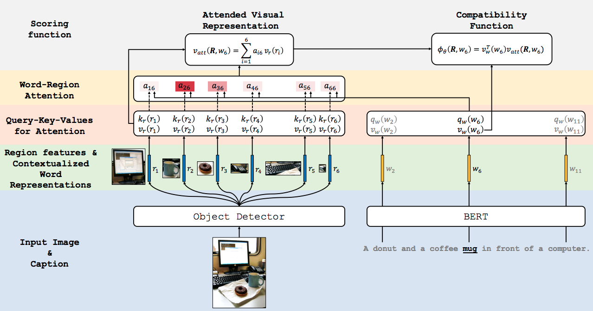
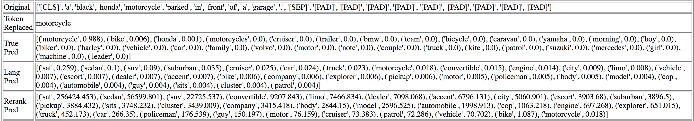

# Contrastive Learning for Weakly Supervised Phrase Grounding
By [Tanmay Gupta](http://tanmaygupta.info/info-ground/), [Arash Vahdat](http://latentspace.cc/arash_vahdat/), [Gal Chechik](https://chechiklab.biu.ac.il/~gal/), [Xiaodong Yang](https://xiaodongyang.org/), [Jan Kautz](https://research.nvidia.com/person/jan-kautz), and [Derek Hoiem](http://dhoiem.cs.illinois.edu/)

<p align="center">
    
</p>

**Available on Arxiv**: [https://arxiv.org/abs/2006.09920](https://arxiv.org/abs/2006.09920)

**Project Page**: [http://tanmaygupta.info/info-ground/](http://tanmaygupta.info/info-ground/)

**BibTex**:
```
@article{gupta2020contrastive,
  title={Contrastive Learning for Weakly Supervised Phrase Grounding},
  author={Gupta, Tanmay and Vahdat, Arash and Chechik, Gal and Yang, Xiaodong and Kautz, Jan and Hoiem, Derek},
  booktitle={ECCV},
  year={2020}
}
```

# Requirements
Create a conda environment with all dependencies provided in the `environment.yml` file using
```bash
conda env create -f environment.yml
```

Activate the environment with
```bash
conda activate info-ground
```

All commands in the following sections are to be executed in the same directory as this `README.md` file.

# Setup file paths and data

<details><summary>COCO</summary>

Update the following paths in `yaml/coco.yml`:

- `downloads_dir`: directory where COCO data would be downloaded (next section provides commands for downloading and)
- `proc_dir`: directory where processed COCO data would be stored
- `exp_dir`: directory where COCO experiment runs would be saved
- `image_dir`: directory where COCO images would be extracted
- `local_proc_dir`: a local copy of `proc_dir` if frequent reads from `proc_dir` is a problem. This is useful, for example, if `proc_dir` is NFS shared across multiple machines and `local_proc_dir` is local data storage for the machine you want to run experiments on. We provide scripts for copying files from `proc_dir` to `local_proc_dir`.

In my setup `downloads_dir`, `proc_dir`, and `exp_dir` are directories on a shared NFS storage while `image_dir` and `local_proc_dir` point to local storage. 

Once the paths are setup in `yaml/coco.yml`, run the following:
```python
# download COCO images and annotations to downloads_dir
python -m data.coco.download
# extract annotations to coco_proc
python -m data.coco.extract_annos
# extract images to image_dir
python -m data.coco.extract_images
```
</details>

<details><summary>Flickr</summary>

Set the `download_dir` variable in `data/flickr/download.sh` to the location where you would like to download the Flickr30K Entities annotations and splits from the github repository. Now, run the following the download and extract the contents of the downloaded `annotations.zip` file in the same directory:
```bash
# clone Flickr30K Entities github repo and extract annotations and splits
bash data/flickr/download.sh
# process annotations into easy to read json files
bash data/flickr/process_annos.sh
```

For access to Flickr30K images, please follow the instructions <a href="http://bryanplummer.com/Flickr30kEntities/">here</a>. You might be required to fill a form. Download the images to a convenient directory whose path will be referred to as `image_dir`.

Now, update the following paths in `yaml/flickr.yml`:
- `downloads_dir`: directory where Flickr data were downloaded (same as the path provided in download.sh file)
- `anno_dir`: directory where Annotations were extracted from the downloaded `annotations.zip` file. This would be `<downloads_dir>/Annotations`.
- `sent_dir`: directory where Sentences were extracted from the downloaded `annotations.zip` file. This would be `<downloads_dir>/Sentences`.
- `proc_dir`: directory where processed Flickr data would be stored
- `exp_dir`: directory where Flickr experiment runs would be saved
- `image_dir`: directory where Flickr images would be extracted
- `local_proc_dir`: a local copy of `proc_dir` if frequent reads from `proc_dir` is a problem. This is useful, for example, if `proc_dir` is NFS shared across multiple machines and `local_proc_dir` is local data storage for the machine you want to run experiments on. We provide scripts for copying files from `proc_dir` to `local_proc_dir`.

In my setup `downloads_dir`, `proc_dir`, and `exp_dir` are directories on a shared NFS storage while `image_dir` and `local_proc_dir` point to local storage. 


</details>


# Get object detections

We provide detections for COCO and Flickr30K images computed using a FasterRCNN model trained on VisualGenome object and attribute annotations originally used in the [Bottom-Up and Top-Down Attention](https://arxiv.org/abs/1707.07998) work and then reused in a recent weakly supervised phrase grounding work [Align2Ground](https://arxiv.org/abs/1903.11649) that we compare to. 

We use a [lightly modified fork](https://github.com/BigRedT/bottom-up-features) of the pytorch implementation available [here](https://github.com/violetteshev/bottom-up-features) to extract bounding boxes, scores, and features from a set of images and save them in hdf5 format. 

Download and extract detections to a desired location:
- [COCO](https://drive.google.com/file/d/1I70cDM2MEe56tZVq8PELffm3S13uYjHV/view?usp=sharing) [20 GB]
- [Flickr30K](https://drive.google.com/file/d/1CxTY38nKPFe9wikEdpeU-XXMwbFs77GV/view?usp=sharing) [5 GB]


# Construct context-preserving negative captions

Follow the instructions for whichever dataset you want to train on.

**Step 1:** Identity noun tokens to be substituted
```bash
# For COCO
bash exp/gen_noun_negatives/scripts/identify_tokens.sh train
bash exp/gen_noun_negatives/scripts/identify_tokens.sh val

# For Flickr
bash exp/gen_noun_negatives/scripts/identify_tokens_flickr.sh train
bash exp/gen_noun_negatives/scripts/identify_tokens_flickr.sh val
```
This creates the following files in `<proc_dir>/annotations`:
- `noun_tokens_<subset>.json`: identified noun tokens in captions
- `noun_vocab_<subset>.json`: noun vocabulary

**Step 2:** Sample substitute words 
```bash
# For COCO
bash exp/gen_noun_negatives/scripts/sample_neg_bert.sh train
bash exp/gen_noun_negatives/scripts/sample_neg_bert.sh val

# For Flickr
bash exp/gen_noun_negatives/scripts/sample_neg_bert_flickr.sh train
bash exp/gen_noun_negatives/scripts/sample_neg_bert_flickr.sh val
```
This creates the following files in `<proc_dir>`:
- `bert_noun_negatives_<subset>.json`: contains negative captions constructed by substituting a word in the positive caption
- `vis_bert_noun_negatives_<subset>.html`: an webpage visualizing words tokens in the positive caption, the token replaced, top 30 negatives sampled from q(s|s',c) (`True Pred`), top 30 negatives sampled from p(s'|c) (`Lang Pred`), reranked Lang Pred negatives (`Rerank Pred`). The last 5 words in Rerank Pred are discarded and remaining 25 are used as negatives. Here's an example:  


**Step 3:** Cache contextualized representations of the substituted words
```bash
# For COCO
bash exp/gen_noun_negatives/scripts/cache_neg_fetures.sh train
bash exp/gen_noun_negatives/scripts/cache_neg_fetures.sh val

# For Flickr
bash exp/gen_noun_negatives/scripts/cache_neg_fetures_flickr.sh train
bash exp/gen_noun_negatives/scripts/cache_neg_fetures_flickr.sh val
```
This creates the following files in `<proc_dir>`:


# Learn to ground

Once we have the following, we are ready to train our grounding model:
- Detections on train and val sets for the dataset you want to train on (COCO or Flickr30K)
- Negatives with cached features for the train and val set for the same dataset

**Step 1:** Identify noun and adjective tokens to maximize mutual information with the image regions.
```bash
# For COCO
bash exp/ground/scripts/identify_noun_adj_tokens.sh train
bash exp/ground/scripts/identify_noun_adj_tokens.sh val

# For Flickr
bash exp/ground/scripts/identify_noun_adj_tokens_flickr.sh train
bash exp/ground/scripts/identify_noun_adj_tokens_flickr.sh val
```
This creates `<proc_dir>/annotations/noun_adj_tokens_<subset>.json`

**Step 2:** Copy over detections and cached features to `<local_proc_dir>`. This may reduce training time if, for instance, `<proc_dir>` is a slow shared NFS and `<local_proc_dir>` is a faster local drive. Otherwise you may skip this step and set `<local_proc_dir>` to the same path as `<proc_dir>`.

To copy, modify path variables `NFS_DATA` and `LOCAL_DATA` in `setup_coco.sh` or `setup_flickr.sh` and execute 
```bash
# For COCO
bash setup_coco.sh

# For Flickr
bash setup_flickr.sh
```

**Step 3:** Start training by executing
```bash
# For COCO
bash exp/ground/scripts/train.sh model_trained_on_coco coco

# For Flickr
bash exp/ground/scripts/train.sh model_trained_on_flickr flickr

# General form
bash exp/ground/scripts/train.sh <exp_name> <training_dataset>
```

# Evaluate on Flickr
To evaluate on Flickr, follow the instructions above to setup Flickr file paths, download/extract the dataset, and download object detections. If needed also run `setup_flickr.sh` to copy files from NFS to local disk after modifying `NFS_DATA` and `LOCAL_DATA` paths in the script.

**Model Selection:** As noted in our paper, we use ground truth annotations in the Flickr validation set for model selection. To perform model selection run
```bash
# For COCO
bash exp/ground/scripts/eval_flickr_phrase_loc_model_selection.sh model_trained_on_coco coco

# For Flickr
bash exp/ground/scripts/eval_flickr_phrase_loc_model_selection.sh model_trained_on_flickr flickr

# General form
bash exp/ground/scripts/eval_flickr_phrase_loc_model_selection.sh <exp_name> <training_dataset>
```

**Model evaluation:** To evaluate the selected model, run 
```bash
# For COCO
bash exp/ground/scripts/eval_flickr_phrase_loc.sh model_trained_on_coco coco

# For Flickr
bash exp/ground/scripts/eval_flickr_phrase_loc.sh model_trained_on_flickr flickr

# General form
bash exp/ground/scripts/eval_flickr_phrase_loc.sh <exp_name> <training_dataset>
```

To provide a sense of variance to expect in pointing accuracy on Flickr30K Entities from training your own models using our repo, here's the performance of one run in comparison to the provided pretrained models:
| Training Dataset  | Flickr Val Accuracy | Flickr Test Accuracy | Flickr Test Accuracy in Paper|
| ------------- | ------------- | ------------- | ------------- |
| Coco  | 75.38  | 76.16 | 76.74 |
| Flickr  | 73.57  | 74.79 | 74.94 |

<br>

**Pretrained Models:** We provide [pretrained models](https://drive.google.com/file/d/1I1IRONgO5DAMlyl55--OovOqPvr7rb7X/view?usp=sharing) trained on both COCO and Flickr to reproduce the numbers in our paper. See `exp/ground/eval_flickr_phrase_loc.py` and `exp/ground/run/eval_flickr_phrase_loc.py` to understand how to load the model.

**Visualize Results:** To visualize grounding on Flickr val set, execute the following:
```bash
# For Coco
bash exp/ground/scripts/vis_att.sh model_trained_on_coco coco

# For Flickr
bash exp/ground/scripts/vis_att.sh model_trained_on_flickr flickr

# General Form
bash exp/ground/scripts/vis_att.sh <exp_name> <training_dataset>
``` 
This would create html pages to visualize top 3 predicted bounding boxes for each word in the caption at `<exp_dir>/vis/attention_flickr`. Open `imgs/example_visualization/index.html` in a browser for an example visualization generated by this script.
